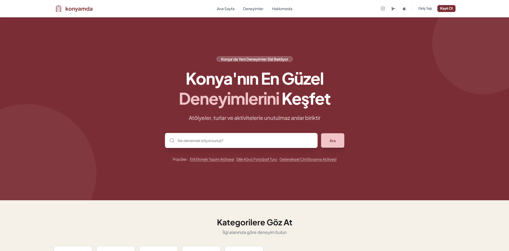
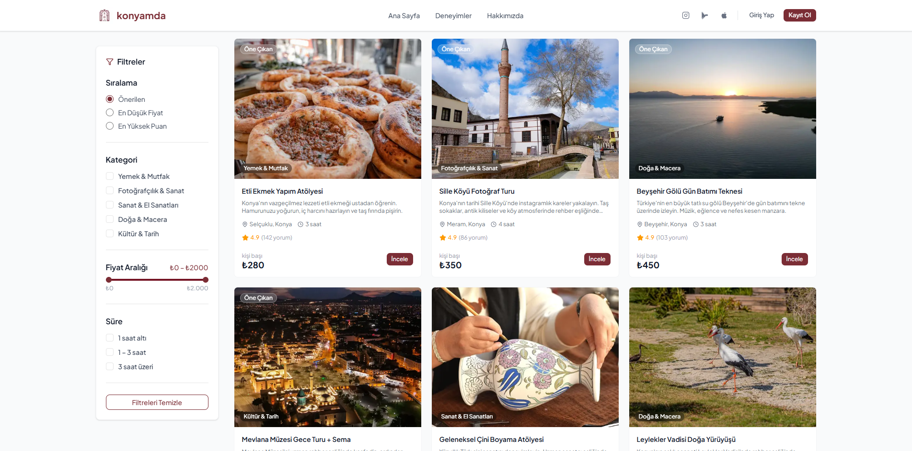
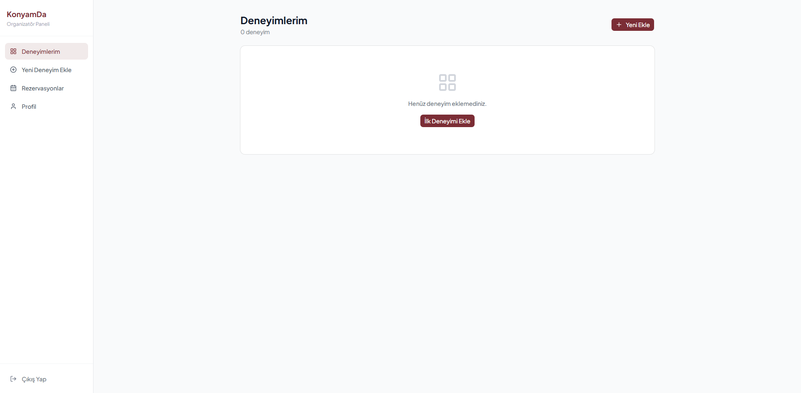

<div align="center">
  

  <h1>konyamda</h1>

  <p>
    Discover, book and experience the best of Konya.
  </p>

  <p>
    <a href="https://konyam-da.vercel.app" target="_blank">
      
    </a>
  </p>

  <p>
    
    
    
    
    
  </p>
</div>

---

## About

konyamda is a local experience marketplace built for Konya, Turkey. Users explore and book workshops, tours, and activities across five categories, while organizers manage their listings and reservations through a dedicated dashboard.

---

## Features

- **Experience Discovery** — Browse 50+ unique local experiences with category and search filters
- **Booking System** — Instant reservations with booking history and status tracking
- **Authentication** — Secure sign-in via email/password and Google OAuth (Supabase Auth)
- **Role-Based Access** — Separate dashboards for users and organizers with server-side route protection
- **Organizer Dashboard** — Create, edit, and delete experiences; view and manage incoming bookings
- **Password Reset** — Secure email-based password reset flow

---

## Tech Stack

| Layer | Technology |
|-------|------------|
| Framework | Next.js 16 (App Router) |
| Language | TypeScript 5 |
| UI | Tailwind CSS v4 + shadcn/ui (Radix UI) |
| Backend / Auth / DB | Supabase (PostgreSQL + Row Level Security) |
| Deployment | Vercel |
| Font | Geist (next/font) |

---

## Screenshots





---

## Getting Started

### Prerequisites

- Node.js 18+
- A [Supabase](https://supabase.com) project

### 1. Clone the repository

```bash
git clone https://github.com/mert-kaymak/KonyamDa.git
cd KonyamDa
npm install
```

### 2. Configure environment variables

```bash
cp .env.example .env.local
```

Open `.env.local` and fill in your Supabase credentials:

```env
NEXT_PUBLIC_SUPABASE_URL=https://<project-id>.supabase.co
NEXT_PUBLIC_SUPABASE_ANON_KEY=<anon-key>
```

> Supabase Dashboard → Project Settings → API

### 3. Run the database schema

Go to Supabase Dashboard → SQL Editor, paste the contents of `supabase/schema.sql`, and run it.

Tables created: `profiles`, `categories`, `experiences`, `bookings`, `reviews`

### 4. (Optional) Google OAuth

Supabase Dashboard → Authentication → Providers → Google  
Callback URL: `https://<domain>/auth/callback`

### 5. Start the development server

```bash
npm run dev
```

Open [http://localhost:3000](http://localhost:3000).

---

## Scripts

```bash
npm run dev      # Development server (Turbopack)
npm run build    # Production build
npm run start    # Production server
```

---

## Team

<table>
  <tr>
    <td align="center">
      <br/>
      <b>Mert Kaymak</b><br/>
      <sub>Co-founder & CEO</sub>
    </td>
    <td align="center">
      <br/>
      <b>Ahmet Alperen Arslan</b><br/>
      <sub>Co-founder & CTO</sub>
    </td>
    <td align="center">
      <br/>
      <b>Toygun Galyan</b><br/>
      <sub>Co-founder & CMO</sub>
    </td>
  </tr>
</table>

---

## Contact

**Email:** iletisim.konyamda@gmail.com  
**Web:** [konyam-da.vercel.app](https://konyam-da.vercel.app)  
**Location:** Selçuklu, Konya, Turkey

---

<div align="center">
  <sub>© 2026 konyamda — Konya's local experience platform</sub>
</div>
